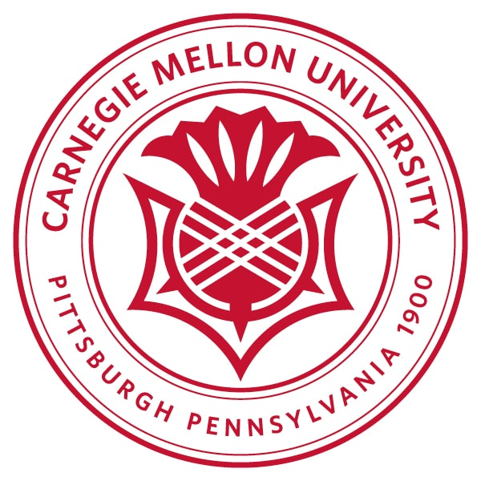

---
# An instance of the Experience widget.
# Documentation: https://docs.hugoblox.com/page-builder/
widget: experience

# This file represents a page section.
headless: true

# Order that this section appears on the page.
weight: 30

title: Education
subtitle:

# Date format for experience
#   Refer to https://docs.hugoblox.com/customization/#date-format
date_format: Jan 2006

# Experiences.
#   Add/remove as many `experience` items below as you like.
#   Required fields are `title`, `company`, and `date_start`.
#   Leave `date_end` empty if it's your current employer.
#   Begin multi-line descriptions with YAML's `|2-` multi-line prefix.
experience:
  - title: Master of Science in Mechanical Engineering - Reserch (MSME-R)
    company: Carnegie Mellon University
    company_url: ''
    company_logo: 
    location: Pittsburgh
    date_start: '2022-09-06'
    date_end: '2024-05-01'
    description: |2-
        * Research student at Biobotics Lab
        * research in Modular robot ditributed control and quardruped Planning over Control

  - title: BASc in Eletrical and Computer Engineering
    company: University of British Columbia
    company_url: ''
    company_logo: org-x
    location: California
    date_start: '2016-01-01'
    date_end: '2020-12-31'
    description: My dissertation was on X

design:
  columns: '1'
---
